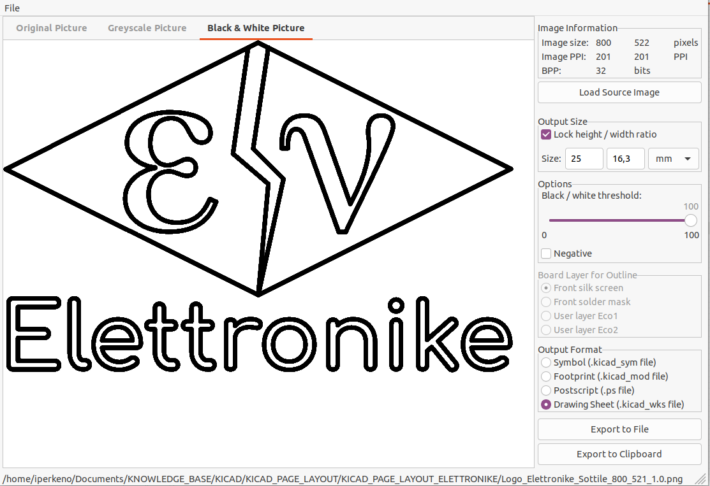

# Logo-Elettronike
Logo Elettronike

Font: Free-Serif

## Logo Elettronike Diamond

## Logo Elettronike Diamond Sottile

**Font**
Greek letters in logo: *FreeSerif*    
Elettronike: *Latin Modern Sans Quotation*    

**Image size**   
width:  800 px @ 201.28 dpi   
height: 522 px @ 201.28 dpi   

Per migliorare la resa dopo la conversione con ImageConverter di Kicad,
è consigliabile mantenere le dimensioni dell'imaagine elevate.
Al momento della conversione si ridimensiona l'immagine, 
mantenendo le proporzioni bloccate, ad una altezza di 25mm.
Si imposta la soglia B/W al masssimo.

## Logo Iperkeno Capsule

**Image size**   
width:  345 px @ 300 dpi   
height: 345 px @ 300 dpi   

